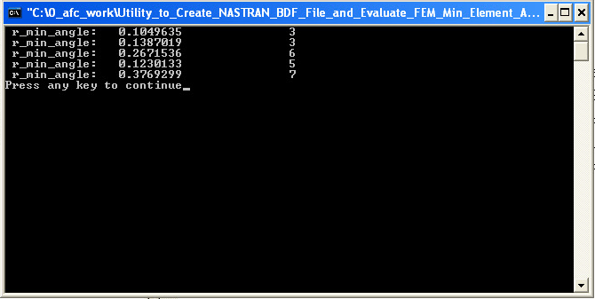

# ========================================
# Utility to Create NASTRAN BDF File and Evaluate FEM Min Element Angles:
# ========================================

## Utility to Create NASTRAN BDF File and Evaluate FEM Minimum Triangle Element Angles.

##
## I. Source FEM Mesh for Which Triangle Element Minimum Element Angles are Evaluated:

##
## II. Utility Executable: "./bin/duct_geom.exe"

##
## III. Utility Input Files:
### III.a. "./input/all_node_list.dat"
### III.b. "./input/corner_node_list.dat"
### III.c. "./input/edge_node_list.dat"

##
## IV. Utility Output File: "./output/output.bdf"
